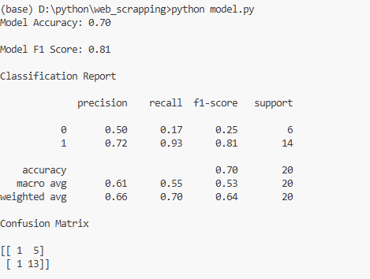
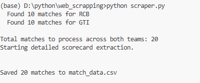

# IPL Match Winner Prediction Model
 
 ## RCB and GT team selected as web scraping on howstat website and built model on that 20 out of 17 records

- Web scraped IPL match data 2 teams each 10 records 
- performed data cleaning and formating 

---

## features  generation and encoding (data transforming)

- Team 1 ,Team 2 , Venue column label encode 
- By Date column extract day_of_week mathc played
- Column generated is_win_team_home_ground
- From Top_Scorer name frequency encode fo better understanding pattern of data by model
- score_buket column create for low , medium and high bins of Top_Score column instead of continuos values
- Target column if team 1 win set 1 otherwise team 2 win set 0
- Also used two methods is_home and extract_winner for home ground team win and exact winner team name

---

## Algorithm Used — XGBoost
 
XGBoost (Extreme Gradient Boosting) was choose because:
- dataset is small
- and tree based algorithm works well on label encoding 
- works on multiple decision trees one after another correcting previous error


---

## Model Evaluation

here used sklearn library **Leave-One-Out Cross Validation(LOO-CV)** cause train_test_split not efficiently work on very small dataset.
- where LOO-CV works as out of n samples take n-1 sample as train and tests on 1 , that repeats on n times.

Model accuracy:



| Metric | Score |
|---|---|
| Accuracy | 0.70 |
| F1 Score | 0.81 |


### Confusion Matrix
 
```
Predicted →    Team 2 win    Team 1 win
Team 2 win  [     1              5     ]
Team 1 win  [     1             13     ]
```

###Output of scraper.py

---

## How to Run

- also check python base version 3.8 or above works fine
- if scraper.py don't run then first run it 
- for scraper.py install dependencies 

```bash
pip install requests beautifulsoup4 pandas
```
- after running go to step 1 below


1. Install dependencies
```bash
pip install pandas scikit-learn xgboost
```

2. Run the file 
```bash
python model.py
```

---

## challanges faced

- When structuring the data split for training and evaluation in model.py, I initially overlooked how to handle a smaller sample size effectively using traditional train/test splits.
- I recalled that Leave-One-Out Cross-Validation (LOO-CV) is specifically optimized for small datasets. By implementing LOO-CV, the pipeline iteratively trains on all data points except one, evaluating the model thoroughly across the entire sample size without losing critical training information.

- My initial attempt at building the scraper from scratch failed because web structures are highly dynamic and unforgiving with strict element paths and hidden formatting bugs (such as tracking team row summaries or special character markers).
- I went back to my learning resources, reviewed web scraping fundamentals, and adopted an iterative development strategy. By isolating components and building, testing, and debugging individual functions one by one, I successfully overcame the errors and stabilized the full scraping pipeline.

---

## Files

1. scraper.py # web scraping on howstat website on IPL series matches

2. match_data.csv # this file generate after running scraper.py successfully

3. model.py # on match_data build model named XGBoostClassifier

---

- I want to try RAG approch but one last paper is near so i done two task initally but in my github repo I am learning and working on RAG app. 


